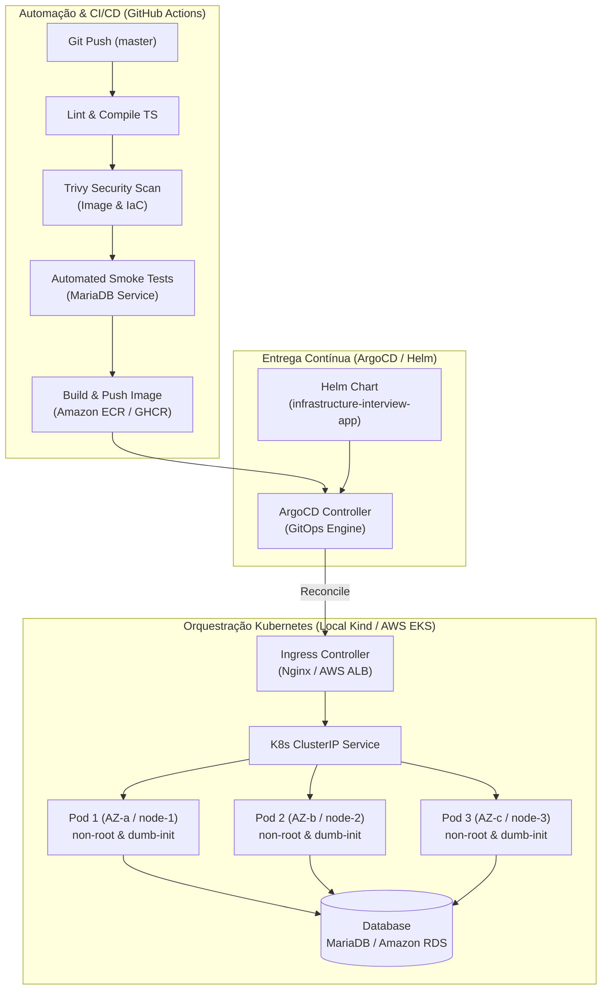

# Liferay Infrastructure & DevOps Challenge

Solução completa de infraestrutura, conteinerização, orquestração Kubernetes, GitOps e automação CI/CD para a aplicação Node.js / TypeScript com suporte a execução local (Kind/Minikube) e arquitetura de produção em nuvem (AWS EKS + Terraform).

---

## 🏛️ Arquitetura da Solução



---

## 🚀 Como Executar e Testar Localmente

A solução foi projetada para que os avaliadores consigam subir e validar todo o ambiente localmente com **apenas 1 comando**.

### Pré-requisitos Locais
- `docker`
- `kind`
- `kubectl`
- `helm`

---

### Opção 1: Setup Automatizado em 1 Comando (Recomendado)

O script automatizado provisiona um cluster Kind com 3 nós simulando **3 Zonas de Disponibilidade (Multi-AZ)**, compila a imagem Docker, carrega no cluster, instala o NGINX Ingress Controller, o banco MariaDB, implanta o Helm Chart e roda os testes de fumaça:

**No Linux / macOS / WSL:**
```bash
make cluster-up
# ou diretamente:
./scripts/setup-local-cluster.sh
```

**No Windows (PowerShell):**
```powershell
.\scripts\setup-local-cluster.ps1
```

Para desmontar o cluster local ao finalizar:
```bash
make cluster-down
# ou ./scripts/teardown-cluster.sh
```

---

### Opção 2: Deploy Local via Helm Manual

Caso você já tenha um cluster Kubernetes rodando (`minikube`, `kind` ou `k3d`):

1. **Subir o banco de dados MariaDB:**
   ```bash
   kubectl apply -f k8s/mariadb.yaml
   ```

2. **Instalar a aplicação via Helm com os valores locais:**
   ```bash
   helm upgrade --install interview-app ./helm/infrastructure-interview-app \
     -f ./helm/infrastructure-interview-app/values-local.yaml
   ```

3. **Verificar os pods e serviços:**
   ```bash
   kubectl get pods -l app.kubernetes.io/name=infrastructure-interview-app
   ```

---

### Opção 3: Deploy Local com GitOps (ArgoCD)

Se desejar testar a reconciliação declarativa com o **ArgoCD**:

1. **Instalar o ArgoCD no cluster:**
   ```bash
   kubectl create namespace argocd
   kubectl apply -n argocd -f https://raw.githubusercontent.com/argoproj/argo-cd/stable/manifests/install.yaml
   kubectl wait --namespace argocd --for=condition=ready pod --all --timeout=180s
   ```

2. **Aplicar o manifesto GitOps da aplicação:**
   ```bash
   kubectl apply -f argocd/application-local.yaml
   ```

3. **Acessar a UI do ArgoCD:**
   ```bash
   kubectl port-forward svc/argocd-server -n argocd 8080:443
   ```
   - URL: `https://localhost:8080` (Usuário: `admin`)
   - Senha inicial:
     ```bash
     kubectl -n argocd get secret argocd-initial-admin-secret -o jsonpath="{.data.password}" | base64 -d
     ```

---

## ☁️ Setup para Nuvem (AWS EKS + Terraform)

A infraestrutura para ambiente corporativo / nuvem foi declarada em código na pasta [`terraform/`](terraform/).

### Destaques da Arquitetura Cloud:
- **VPC Multi-AZ**: Subnets públicas e privadas distribuídas em 3 Availability Zones (`vpc.tf`).
- **Cluster EKS Gerenciado**: Node group com capacidade sob demanda e autoscaling (`eks.tf`).
- **Autenticação OIDC Passwordless**: Sem chaves estáticas da AWS no GitHub (`oidc.tf`). A pipeline assume uma IAM Role dinamicamente via GitHub OIDC Provider.
- **Segurança de Segredos**: Integração com AWS Secrets Manager e IRSA (IAM Roles for Service Accounts) via External Secrets Operator (`secrets.tf`).
- **Helm Values de Produção**: [`helm/infrastructure-interview-app/values-production.yaml`](helm/infrastructure-interview-app/values-production.yaml) com:
  - `topologySpreadConstraints`: Distribuição forçada por zona (`DoNotSchedule`).
  - `autoscaling`: HPA ativado (3 a 12 réplicas) com métricas de CPU e Memória.
  - `podDisruptionBudget`: PDB garantindo alta disponibilidade durante upgrades.
  - `ingress`: Integração com AWS Load Balancer Controller e terminação TLS.

### Como Provisionar na AWS:
```bash
cd terraform
cp terraform.tfvars.example terraform.tfvars
# Ajuste as variáveis desejadas
terraform init
terraform plan
terraform apply
```

Para aplicar no ArgoCD em produção:
```bash
kubectl apply -f argocd/application-production.yaml
```

---

## 🛡️ Segurança, Hardening e Boas Práticas

1. **Dockerfile Multi-Stage Otimizado**:
   - Compilação isolada no stage `builder`.
   - Runtime enxuto em `node:20-alpine` no stage `runner`.
   - Remoção de gerenciadores de pacote (`npm`, `npx`) da imagem final de produção para eliminação da superfície de ataque.
   - Execução como usuário não-root (`USER node`, UID 1000).
   - Gerenciamento seguro de sinais de processos via `dumb-init`.
2. **Scanner Contínuo de Vulnerabilidades**:
   - Integração com **Trivy** no GitHub Actions para auditoria de imagens Docker e manifestos de Infraestrutura como Código (IaC).
   - Tratamento documentado de dependências legadas via `.trivyignore`.
3. **Resiliência Kubernetes**:
   - `readinessProbe` e `livenessProbe` apontando para `/readyz` e `/healthz`.
   - `networkpolicy.yaml`: Isolamento restrito do tráfego de rede no cluster.
   - `pdb.yaml`: Prevenção contra indisponibilidade durante manutenção dos nós.

---

## 🧪 Testes de Fumaça (Smoke Tests)

A suíte de testes de fumaça valida o fluxo de ponta a ponta da API (criação e listagem de entidades):

```bash
# Executar localmente apontando para o endpoint da aplicação:
APP_URL="http://localhost" node tests/smoke-test.js
```